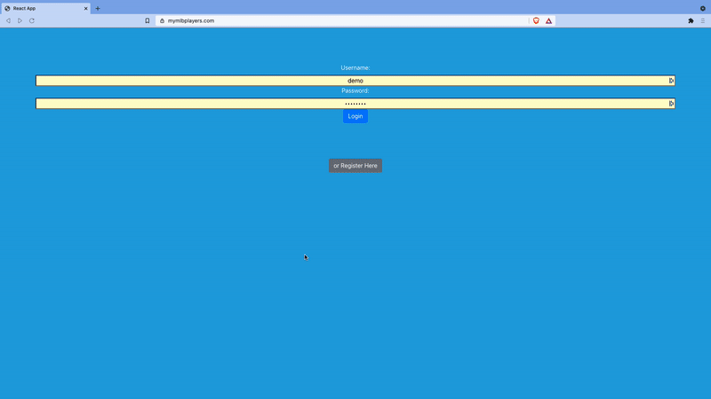

# MLB Favorite Players

### General Information
This project displays MLB batters statistics using a free <a href="https://appac.github.io/mlb-data-api-docs/">API</a>, and it allows the user to add their favorite players and track their statistics throughout the season. This project is live at: https://mymlbplayers.com/.

### Technologies
- HTML & CSS
- Bootstrap
- MongoDB
- Mongoose
- Express.js
- React.js
- Node.js

